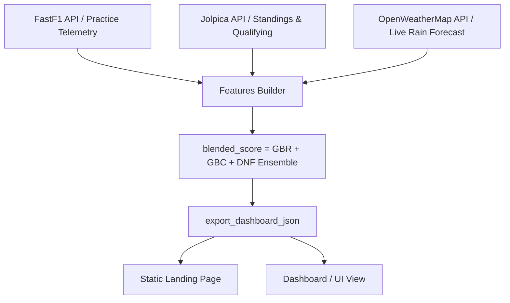

# F1 Predict — Telemetry-Driven 2026 Predictions

A multi-task Gradient Boosting Machine (GBM) ensembled predictor that forecasts Formula 1 Grand Prix outcomes using weather forecasts, practice pace telemetry, and historical results.

<div align="center">
  <video src="https://github.com/user-attachments/assets/e92e0b88-7dfa-495a-be41-f63a186fd7a1></video>
</div>

---

## 1. Machine Learning Core (Predictive Intelligence)

Instead of relying on base racing metrics, **F1 Predict** builds a multi-task ensembled model leveraging three distinct **scikit-learn** Gradient Boosting estimators.

### The Blended Multi-Task Ensemble
The final starting grid ordering is ranked using a custom **Blended Score** combining regressed position, winner classification probability, and DNF risk:

```
blend_score = (0.6 * reg_score + 0.4 * win_prob) * (1.0 - 0.6 * dnf_risk)
```

*   **Position Regressor (GBR)**: Predicts the raw finishing position of each driver on Sunday based on qualifying positions and pace signals.
*   **Winner Classifier (GBC)**: Estimates the binary probability ($[0, 1]$) of a driver winning the race, heavily weighted on qualifying pole margins and track overtaking complexity.
*   **DNF Risk Classifier (GBC)**: Classifies the probability of a driver failing to finish due to mechanical failure or racing incidents, utilizing circuit-specific historical retirement rates and constructor reliability factors.

### Feature Engineering
The model extracts and normalizes the following key features from telemetry and standings:
*   `fp2_pace_delta_to_fastest`: Median long-run lap pace delta in FP2/FP1 (fuel-corrected back to empty tank equivalency).
*   `quali_gap_to_pole`: Exact qualifying gap in seconds (0.00 for the pole sitter).
*   `team_season_points_ratio`: Total constructor points divided by the championship leader's points (updated dynamically pre-race).
*   `driver_recent_form`: A rolling average of the driver's finishing positions over the last 3 completed races.
*   `grid_x_overtaking_index`: An interaction term crossing starting grid position with the circuit's overtaking difficulty index (1=Easy, 2=Medium, 3=Hard).

### GroupKFold Cross-Validation
To guarantee model generalization and prevent **same-race data leakage** (testing on drivers from the same Grand Prix used in training), the models are evaluated using a **10-Fold GroupKFold validation strategy** grouped by `(season, round)`.

---

## 2. Backend & Data Pipeline Engineering

The backend logic orchestrates data extraction, caching, retries, and data transformations into a unified pipeline.



### Live Data Acquisition & Telemetry Parsing
*   **FastF1 Telemetry Interface**: Loads lap-by-lap session timing data. Excludes out/in laps and outliers (>107% of driver median) to isolate consistent race runs, performing empty-tank fuel corrections.
*   **Jolpica (Ergast Mirror) API**: Fetches live season schedules, starting grids, in-season standings, and qualifying lap times.
*   **OpenWeatherMap API**: Integrates live location-based coordinates to fetch rain probability forecasts during the scheduled race time window.

### Pipeline Resilience
*   **Exponential-Backoff Retry Logic**: Built-in HTTP wrappers automatically catch transient network exceptions and API rate-limiting errors (`HTTP 429` / `500`), sleeping and retrying requests up to 4 times to ensure build completions.
*   **Local Caching (joblib)**: Raw and enriched historical dataframes are cached locally. This reduces pipeline execution time for consecutive runs from **40+ minutes** to **less than 1 second**.
*   **Multi-Directory JSON Sync**: The export pipeline writes the ensembled simulation output (`race_results.json`) directly to both the landing page and dashboard folders, ensuring data consistency across deployment surfaces.

---

## 3. Interactive Frontends

The presentation layer is split into two static responsive web applications deployed on a single domain.

### Dynamic Dashboard (`/dashboard/`)
*   **Podium Win Rings**: Visualizes ensembled winner probabilities dynamically using SVG circular dash offsets.
*   **Forecast Monitors**: Shows safety car frequencies and rain forecasts directly from live weather JSON payloads.
*   **Nerd Zone Panel**: A dedicated technical view including interactive feature importance charts (using Chart.js), model pipeline explanations, and cross-validation logs.
*   **Cache Busting**: Assets are requested using a timestamp-based cache-buster parameter (`?t=`) to prevent browsers from displaying cached results after a new prediction cycle.

### 3D Cinematic Landing Page (`/`)
*   **Three.js Engine**: Renders a high-fidelity 3D F1 car model (`.glb`) suspended on a WebGL canvas.
*   **Scroll-Driven Camera Splines**: Follows interactive scroll-driven splines, orbiting the cockpit, diffuser, and front wing depending on the viewport scroll percentage.
*   **Dynamic Stats**: Dynamically queries `race_results.json` on load to render the latest prediction stats (accuracy called ratio and mean absolute error) without hardcoded values.

---

## 4. Quick Start Guide

### Prerequisites
*   Python 3.11+
*   Node.js (for Vercel CLI, optional)

### 1. Install Python Dependencies
```bash
pip install -r requirements.txt
```

### 2. Configure Environment Secrets
Create a `.env` file at the root directory and add your OpenWeatherMap API key:
```env
OPENWEATHER_API_KEY=your_openweathermap_api_key_here
```

### 3. Run Predictions & Export Simulation Data
To run the ensembled predictions for the full season and update the web applications:
```bash
python Main_Prediction_Script/pred_advanced.py --dashboard
```

### 4. Running Locally
You can run the landing page and dashboard locally using python's built-in server:
```bash
# Start Landing Page (served at http://localhost:5501)
python -m http.server 5501

# Start Dashboard (served at http://localhost:5500)
python -m http.server 5500 --directory dashboard
```
*(On Vercel, the project is deployed as a single project serving root `/` and `/dashboard/` without requiring any background servers).*

---

## 5. Contact, License & Acknowledgements

### Contact Me
*   **Shyam Narayan Nayak**
*   **GitHub**: [@ShyamNayak27](https://github.com/ShyamNayak27)
*   **LinkedIn**: [Shyam Narayan Nayak](https://www.linkedin.com/in/shyamnnayak/)
*   **Email**: [shtrillion@gmail.com](mailto:shtrillion@gmail.com)

### License
This project is licensed under the MIT License - see the [LICENSE](LICENSE) file for details.

### Acknowledgements
*   [FastF1](https://github.com/theOehrly/Fast-F1) for practice telemetry and timing database access.
*   [Jolpica-Ergast F1 API](https://api.jolpi.ca/ergast/f1/) for schedules, qualifying, and race weekend results.
*   [OpenWeatherMap API](https://openweathermap.org/) for live weather forecasts.
